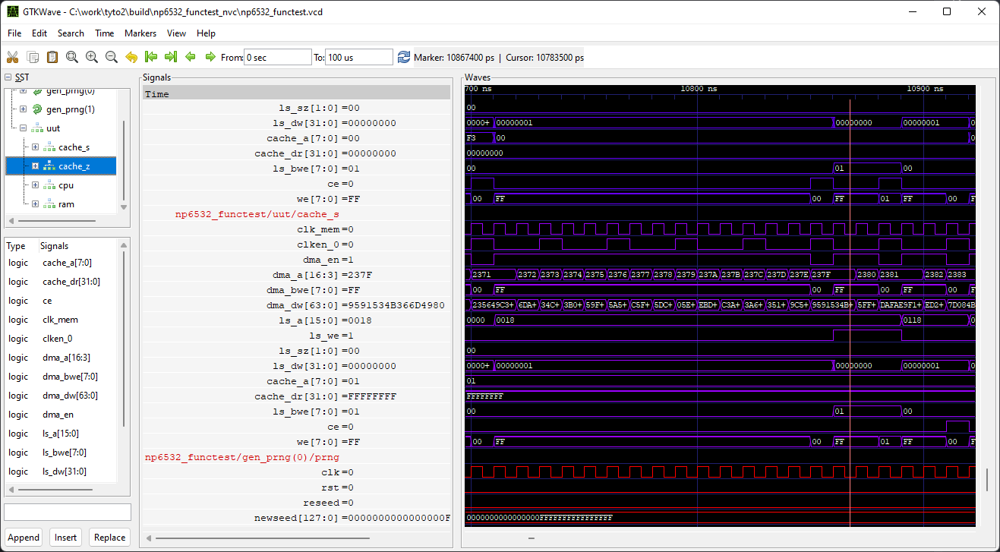

PyVCD2GTKW is a Python script that generates a save file for the GTKWave waveform viewer application from a simulation VCD (Value Change Dump) file.

The script is very simple. It processes the definitions section of the VCD file to extract signals and the hierarchy level that they belong to, and writes these out in the same order that they were read in, with added comments and colour cycling to make the waveform clear. See below for an example.

Python 3 is required to run PyVCD2GTKW.

